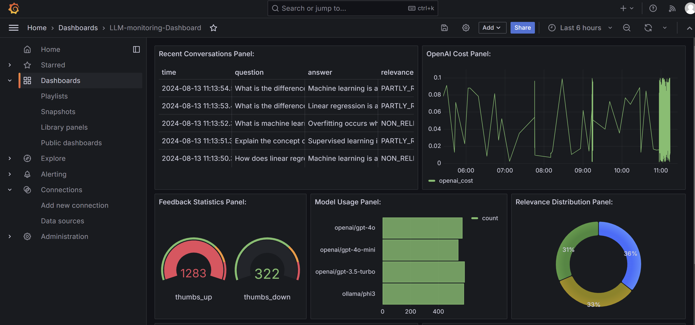

*** 04 - Monitoring ***

Q) How to Monitor LLM ANswer quality?
- 1. compute different types of quality metrics
- 2. store quality metrics in the relational databases (Postgres)
- 3. use LLM's as a judge to compute the toxicity of the LLM answer.
- 4. use LLm.s as a judge to assess the quality pf the LLM answer.
- 5. use Grafana to visulaize metrics over time
- 6. Monitoring answer quality with user feedback
    - a. store chat sessions and collect user feedback in the datatbase
    - b. connect database to Grafana to visualize user feeedback and corrosponding chat sessions
    - c. topic clustering, textual user feedback
- 7. Cost of used infrastructure i.e Vector store and LLM API
- 8. System Metrics: Latency, Traffic, Errors, Saturation

Evaluation of prompt and LLM:
- Two types: 

    1. Offline Evaluation (before deploying): cosine similarity, llm as a judge
        - so we have original answers from documents.json
        - ground truth dataset (questions)
        - answers from LLM
        we will evalute using below:
        * cosine(original_answers, answers_llm)
        * llm_judge(original_answers, answers_llm)
        * llm_judge(question, answers_llm) - sometimes we dont have original answers

    2. Online Evaluation (after deploying): A/B test, experiments
        - user feedback +1 for relevant and -1 for not relevant

    
    
    